# 内部财务管理系统（ERP）— 项目知识图谱

> 用途：作为「读取代码 / 定位模块 / 理解业务」的导航地图。
> 适用对象：开发者、AI 助手。
> 维护说明：新增模块时请同步更新「模块映射表」「数据模型」「业务流程」三节。

---

## 1. 项目定位

为一家约 10 人的**专利买卖公司**开发的内部财务管理系统，是主项目 `patent-notice-system`（专利通知系统）的**子项目**，复用其用户体系（跨库只读访问 `users` 表）。

核心目标：
- 打通**企业微信审批**，审批通过后自动同步合同/付款数据；
- 实时展示**现金流、利润、成本**等核心指标；
- 管理囤积专利的**库存、维持成本（年费）、库龄、异常监控**；
- 支撑 **HR 薪酬**（业绩 → 提成 → 工资条）核算。

| 维度 | 说明 |
|------|------|
| 部署 | 腾讯云，子域名 `erp.iptt.top`，后端端口 `3001` |
| 数据库 | 独立 `erp_db`；跨库只读 `patent_notice_system`（users 等） |
| 时区 | 全局 `Asia/Shanghai`（`+08:00`） |
| API 前缀 | `/api/v1` |

---

## 2. 技术栈

| 层 | 技术 |
|----|------|
| 前端 | Vue 3 + Vite 5 + Element Plus + Pinia + Vue Router 4 + ECharts 5 + Axios + dayjs |
| 后端 | Node.js + Express 4 + Sequelize 6 + MySQL(mysql2) + Redis(ioredis) |
| 鉴权 | JWT + bcrypt；支持 URL token 单点登录（SSO） |
| 外部集成 | 企业微信（审批同步/推送）、腾讯云 COS（附件）、IP 系统（专利年费/法律状态查询） |
| 工具库 | node-cron（定时任务）、winston（日志）、ExcelJS（导入导出）、joi（校验）、multer（上传）、helmet/cors/compression/express-rate-limit |

---

## 3. 系统架构总览

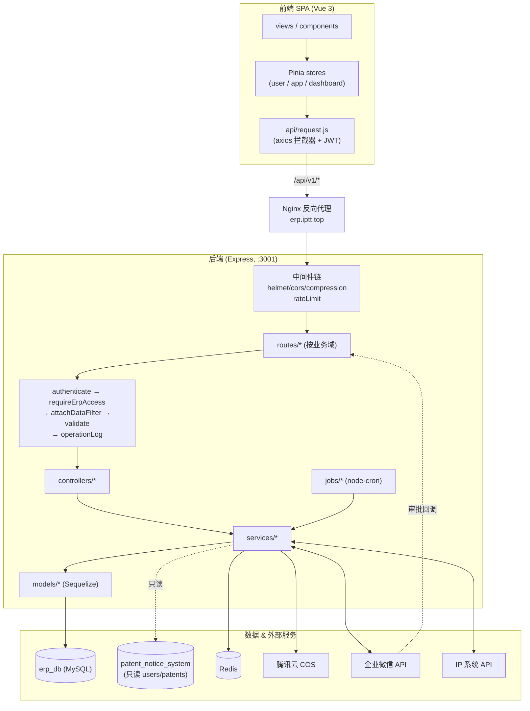

---

## 4. 后端分层与请求生命周期

调用链固定为 **route → 中间件链 → controller → service → model**。Controller 只做参数解析与响应封装，**业务逻辑全部在 service**，model 仅定义表结构与关联。

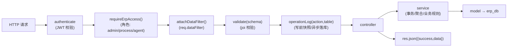

目录职责（`backend/src/`）：

| 目录 | 职责 |
|------|------|
| `app.js` | 入口：中间件、路由挂载、双库连接、启动定时任务 |
| `config/` | `database.js`(erp_db)、`mainDatabase.js`(主库只读)、`wechat.js` |
| `routes/` | 按业务域拆分；统一在 `routes/index.js` 注册 |
| `controllers/` | 请求处理（21 个），薄层 |
| `services/` | 业务逻辑（30 个），含事务、聚合、外部调用 |
| `models/` | Sequelize 模型（27 个），关联集中在 `models/index.js` |
| `middlewares/` | `auth` `permission` `validate` `errorHandler` `operationLog` |
| `validators/` | joi 校验 schema |
| `jobs/` | node-cron 定时任务（6 个） |
| `utils/` | `logger` `errors` `pagination` `excelHelper` |

> 统一响应格式：`{ success: true, data }` 或经 `errorHandler` 输出 `{ success:false, code, message }`。

---

## 5. 鉴权与权限模型

**ERP 三种角色**（来自主项目 users.role，JWT 携带）：`admin`、`process`、`agent`。其余角色（client 等）一律 403。

| 中间件 | 作用 |
|--------|------|
| `authenticate` | 校验 Bearer JWT，注入 `req.user = {id, username, role}` |
| `requireErpAccess()` | 仅放行 admin/process/agent |
| `requireAdmin()` | 仅放行 admin（薪酬、员工、系统设置、归类规则、日志等） |
| `attachDataFilter()` | 数据隔离：注入 `req.dataFilter` |

**数据隔离规则**（`permission.dataFilter`）：
- `admin` / `process` → `{}`（可见全部）；
- `agent` → `{ [ownerField]: user.id }`（仅自己 `created_by`/`owner_id` 的数据）。

**前端鉴权**：`router.beforeEach` 守卫；URL `?token=` 自动写入并清除（SSO 跳转）；`meta.role==='admin'` 控制 admin 专属菜单；`meta.watermark` 给薪酬类页面加水印（`components/common/Watermark.vue`）。

---

## 6. 业务模块映射表（核心导航）

> 列含义：API 前缀 → 路由文件 → 控制器 → 服务 → 模型 → 前端页面 / 前端 API。
> 标「(路由内联)」表示该域无独立 controller，逻辑写在 route 内或直接调用 service。

| 业务域 | API (`/api/v1`) | 路由 `routes/` | 控制器 `controllers/` | 服务 `services/` | 主要模型 | 前端页面 `views/` | 前端 API `api/` |
|--------|-----------------|----------------|----------------------|------------------|----------|-------------------|-----------------|
| 认证 | `/auth` | `auth.js` | `authController` | `authService` | MainUser(跨库) | `Login.vue` | `auth.js` + `stores/user.js` |
| 银行账户 | `/accounts` | `accounts.js` | `accountController` | `accountService` | BankAccount, AccountTransfer | `account/AccountList.vue` | `account.js` |
| 客户 | `/customers` | `customers.js` | `customerController` | `customerService` | Customer | `customer/CustomerList.vue` | `customer.js` |
| 供应商 | `/suppliers` | `suppliers.js` | `supplierController` | `supplierService` | Supplier | `supplier/SupplierList.vue` | `supplier.js` |
| 合同 | `/contracts` | `contracts.js` | `contractController` | `contractService` | Contract | `contract/ContractList.vue`, `ContractDetail.vue` | `contract.js` |
| 发票 | `/invoices` | `invoices.js` | `invoiceController` | `invoiceService` | Invoice | `invoice/InvoiceList.vue` | `invoice.js` |
| 收付款 | `/payments` | `payments.js` | `paymentController` | `paymentService` | Payment | `payment/PaymentList.vue` | `payment.js` |
| 看板 | `/dashboard` | `dashboard.js` | `dashboardController` | `dashboardService` | （多表聚合） | `Dashboard.vue` | `dashboard.js` + `stores/dashboard.js` |
| 报销 | `/expenses` | `expenses.js` | `expenseController` | `expenseService` | Expense | `expense/ExpenseList.vue` | `expense.js` |
| 借款 | `/loans` | `loans.js` | `loanController` | `loanService` | Loan, LoanRepayment | `loan/LoanList.vue` | `loan.js` |
| 专利库存 | `/inventory` | `inventory.js` | `inventoryController` | `inventoryService`, `inventoryBatchService`, `patentAnomalyService` | PatentInventory, PatentAnnualFee, PatentPriceHistory, PatentAnomalyAlert | `inventory/InventoryList.vue`, `InventoryDetail.vue`, `SoldAnalytics.vue`, `PatentAnomalyAlerts.vue` | `inventory.js` |
| 交易项目 | `/projects` | `projects.js` | `projectController` | `projectService` | Project | `project/ProjectList.vue`, `ProjectDetail.vue`, `ProfitSankey.vue` | `project.js` |
| 成本 | `/costs` | `costs.js` | `costController` | `costService` | CostRecord, CostCategory | `cost/CostList.vue`, `CostTrendChart.vue` | `cost.js` |
| 系统消息 | `/notifications` | `notifications.js` | `notificationController` | `notificationService` | Notification | `components/layout/NotificationBell.vue` | `notification.js` |
| 企业微信 | `/wechat` | `wechat.js` | `wechatController` | `wechat/wechatSyncService`, `wechatApiService`, `wechatCryptoService`, `wechatFileService` | Contract, Payment 等 | `system/WechatBindings.vue` | — |
| 银行对账 | `/reconciliation` | `reconciliation.js` | `reconciliationController` | `reconciliationService` | BankStatement | `reconciliation/ReconciliationPage.vue` | `reconciliation.js` |
| 数据导出 | `/export` | `export.js` | `exportController` | `exportService` | （多表） | `components/common/ExportButton.vue` | `export.js` |
| 历史导入 | `/import` | `import.js` | `importController` | `importService` | （多表） | `import/ImportPage.vue` | `import.js` |
| 操作日志 | `/logs` | `logs.js` (路由内联, 原生 SQL) | — | — | `operation_logs`(无模型) | `system/OperationLogs.vue` | — |
| 归类规则 | `/classify-rules` | `classifyRules.js` (路由内联, 原生 SQL) | — | （配合 `reconciliationService`） | `classify_rules`(无模型) | `system/ClassifyRules.vue` | — |
| 员工档案 | `/employees` | `employees.js` (路由内联) | — | — | Employee | `employee/EmployeeList.vue` | `employee.js` |
| 文件代理 | `/files` | `files.js` | — | `wechat/wechatFileService` | — | — | — |
| 业绩统计 | `/performance` | `performance.js` | `performanceController` | `performanceService`, `purchaseCommissionService` | PerformanceRecord | `performance/PerformanceDashboard.vue`, `PurchaseCommission.vue` | `performance.js` |
| 业绩上传 | `/performance-import` | `performanceImport.js` (路由内联) | — | `performanceUploadService` | PerformanceImport, PerformanceRecord | `performance/PerformanceImport.vue` | `performanceImport.js` |
| 薪资规则 | `/salary-rules` | `salaryRules.js` (路由内联) | — | `salaryRuleService` | SalaryRule | `system/SalaryRules.vue` | `salaryRule.js` |
| 工资条 | `/payroll` | `payroll.js` (路由内联) | — | `payrollService` | Payroll | `payroll/PayrollList.vue` | `payroll.js` |
| 专利年费查询 | `/patent-fee` | `patentFee.js` | `patentFeeController` | `ipSystemService` | PatentAnnualFee, PatentInventory | （集成于库存页） | `patentFee.js` |
| 系统设置 | `/system-settings` | `systemSettings.js` | `systemSettingController` | `systemSettingService` | SystemSetting | （集成于相关页） | `systemSetting.js` |

---

## 7. 数据模型（ER 图）

> 共 27 个 Sequelize 模型；统一 `create_time`/`update_time` 时间戳。
> 关联集中定义在 `models/index.js`。
> ⚠️ `Payroll`、`SalaryRule` 未在 `models/index.js` 注册关联，由各自 service 直接 `require`。
> ⚠️ `operation_logs`、`classify_rules` 无 Sequelize 模型，用原生 SQL 操作。

### 7.1 核心交易域（合同 / 收付款 / 发票 / 项目）

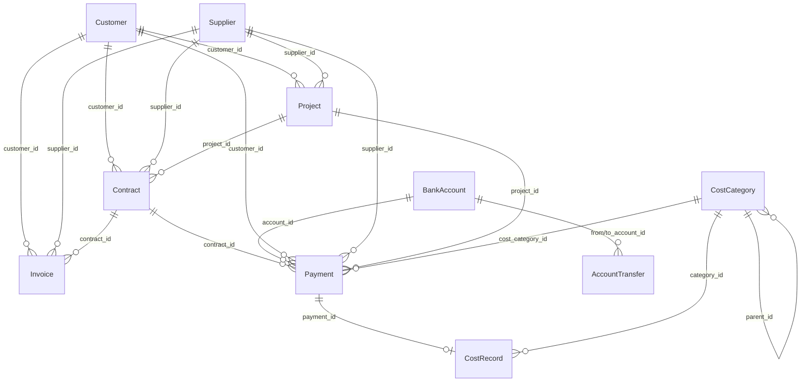

### 7.2 专利库存域

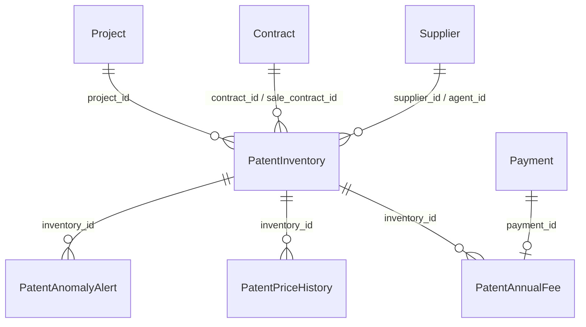

### 7.3 报销 / 借款 / 对账域

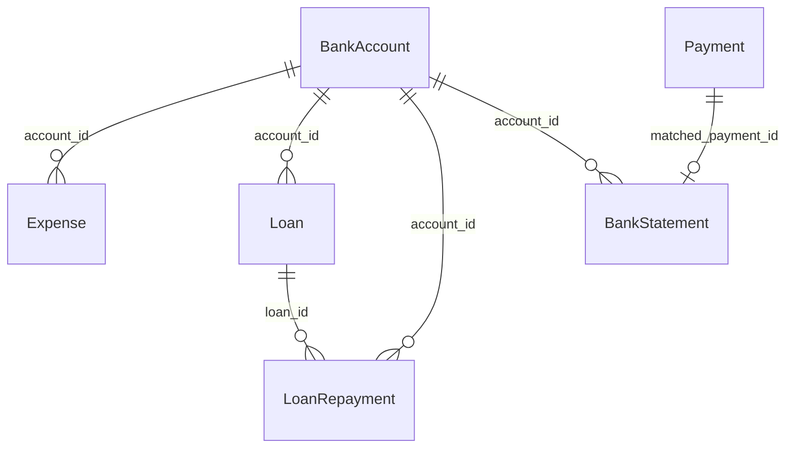

### 7.4 薪酬域

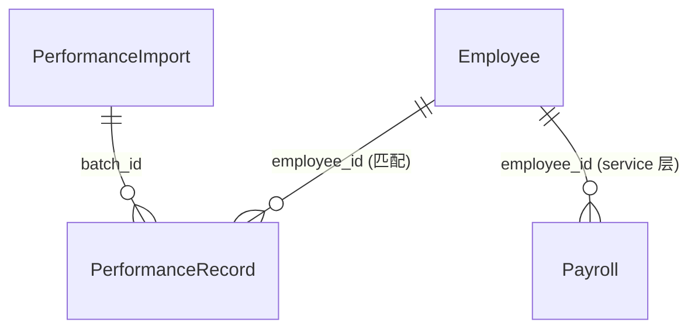

### 7.5 模型字段速查

| 模型 / 表 | 关键字段 | 枚举 / 状态 | 备注 |
|-----------|----------|-------------|------|
| `BankAccount` / bank_accounts | name, account_no(uniq), initial_balance | account_type: public/private | 余额由 `accountService` 聚合（期初+流水） |
| `AccountTransfer` / account_transfers | from_account_id, to_account_id, amount | — | 账户间转账 |
| `Customer` / customers | name, invoice_title, tax_no, main_user_id | — | 开票信息冗余 |
| `Supplier` / suppliers | name, bank_account, tax_rate | — | tax_rate 用于项目税点成本 |
| `Contract` / contracts | contract_no(uniq), amount, paid_amount, sp_no | type: sale/purchase；status: draft/active/completed/terminated；confirm_status: pending/confirmed | 企微同步来源 |
| `Invoice` / invoices | invoice_no, amount, tax_amount, total_amount | type: output/input；invoice_type: normal/special；status: pending/issued/cancelled | 销项/进项 |
| `Payment` / payments | amount, payment_date, account_id, sp_no(幂等) | type: income/expense；category: business/fee；confirm_status: pending/confirmed | **四象限**核心表（见 8.2） |
| `CostRecord` / cost_records | amount, cost_month, category_id, payment_id | is_recurring | 费用类 payment 自动写入 |
| `CostCategory` / cost_categories | name, parent_id | type: labor/operation/patent/marketing/other | 二级分类字典 |
| `Expense` / expenses | user_id, amount, cost_category_id | confirm_status: pending/confirmed | 报销单，独立于 payments |
| `Loan` / loans | amount, repaid_amount, account_id | status: unpaid/partial/paid（自动） | repaid_amount 由还款聚合 |
| `LoanRepayment` / loan_repayments | loan_id, amount, repay_date | — | 写入后重算父 Loan |
| `PatentInventory` / patent_inventory | patent_no(uniq), purchase_price, current_price, total_maintain_cost, next_fee_deadline | status: in_stock/sold/abandoned/transferring；resource_type: own/exclusive_agent/joint_agent | 派生：库龄、预估利润 |
| `PatentAnnualFee` / patent_annual_fees | inventory_id, amount, fee_date, deadline_date | fee_type: annual/agency/other | 重算 inventory 维持成本/到期日 |
| `PatentPriceHistory` / patent_price_history | inventory_id, old_price, new_price | — | 调价审计，只增不改 |
| `PatentAnomalyAlert` / patent_anomaly_alerts | inventory_id, patent_no, dedupe_key | anomaly_type: pledge/license/change/transfer_fee/legal_status/other；severity: info/warning/danger | IP 系统扫描告警 |
| `Project` / projects | name, sale_amount, purchase_amount, tax_cost, maintain_cost, gross_profit | status: active/completed/cancelled | 毛利聚合冗余 |
| `Notification` / notifications | user_id(NULL=广播admin), title, link, dedupe_key | type: contract_expire/fee_deadline/approval_sync/system/other；level: info/warning/danger | 站内消息 |
| `BankStatement` / bank_statements | batch_no, trans_date, amount, matched_payment_id | match_status: unmatched/matched/extra/ignored | 对账流水 |
| `Employee` / employees | name, base_salary, social_insurance_rate, partner_share_rate | role: boss/partner/sales/purchase/admin；status: probation/regular/resigned；grade: A-E | 薪资结构 |
| `PerformanceImport` / performance_imports | year, month, total_performance | status: draft/confirmed | 月度业绩批次 |
| `PerformanceRecord` / performance_records | batch_id, employee_name, performance_amount, final_payment_date | — | 归属「尾款日所在月」 |
| `SalaryRule` / salary_rules | rule_type(uniq), rule_data(JSON) | commission/grade/social_insurance/purchase_commission/general | 规则单例 |
| `Payroll` / payrolls | employee_id, year, month, gross_income, net_salary | status: draft/confirmed/paid/voided | 含调整项 |
| `SystemSetting` / system_settings | setting_key(uniq), setting_value(JSON) | — | 如 channel_sales_cost |
| `MainUser` / users（主库） | username, real_name, role | — | **只读跨库**，含 withPassword scope |

---

## 8. 关键业务流程

### 8.1 企业微信审批同步

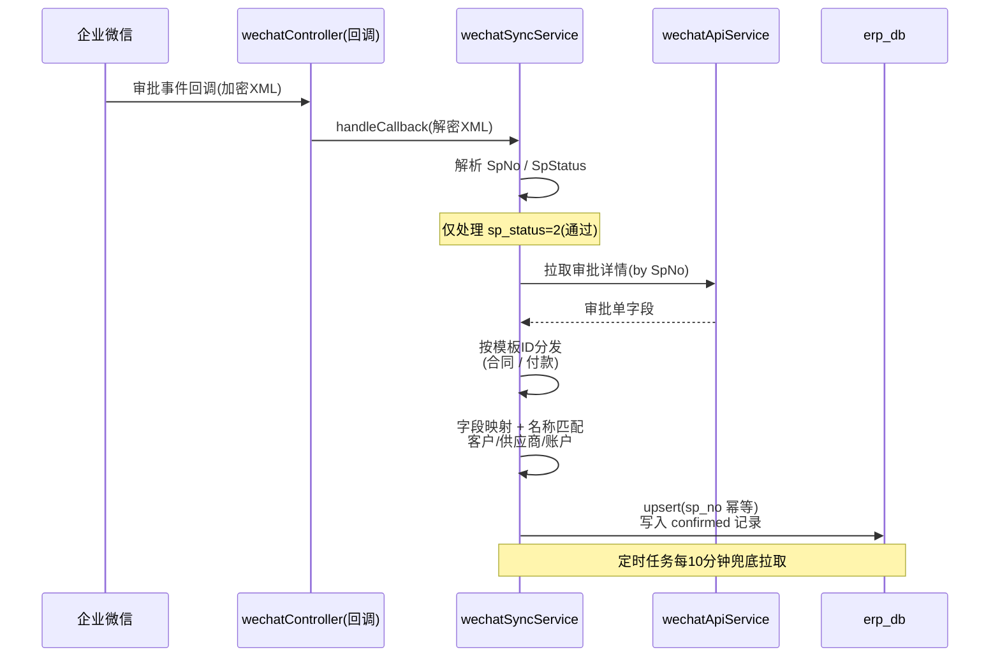

要点：模板 ID → 处理函数映射在 `wechatSyncService.TEMPLATE_HANDLERS`；`sp_no` 唯一约束保证幂等；匹配不到的客户/供应商/账户留空待人工补充。

### 8.2 收付款四象限与成本/项目联动

`Payment` 由 `type × category` 组合出四种业务含义：

| | category=business（关联合同） | category=fee（关联成本类别） |
|--|--|--|
| **type=income** | 销售合同回款 → 累加 `Contract.paid_amount` | 其他收入（利息、退款等） |
| **type=expense** | 采购合同付款 → 累加 `Contract.paid_amount` | 费用支出 → 自动写入一条 `CostRecord` |

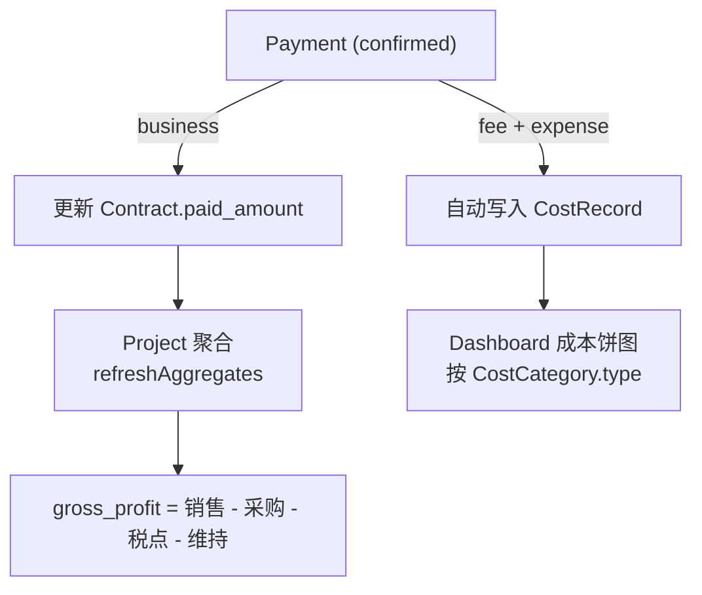

> `confirm_status=pending`（企微同步来的）不影响合同/余额，需人工确认。

### 8.3 专利库存生命周期

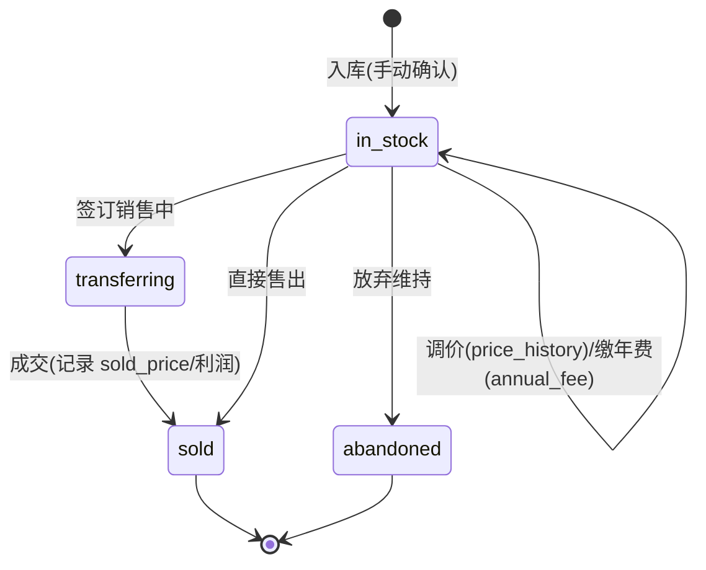

- 维持成本：每笔 `PatentAnnualFee` 写入后重算 `total_maintain_cost` 与 `next_fee_deadline`；
- 异常监控：`patentBatchQueryJob`（每周日）调 IP 系统扫描，发现质押/许可/变更等生成 `PatentAnomalyAlert` + 站内消息（去重键 `dedupe_key`）。

### 8.4 薪酬计算链路

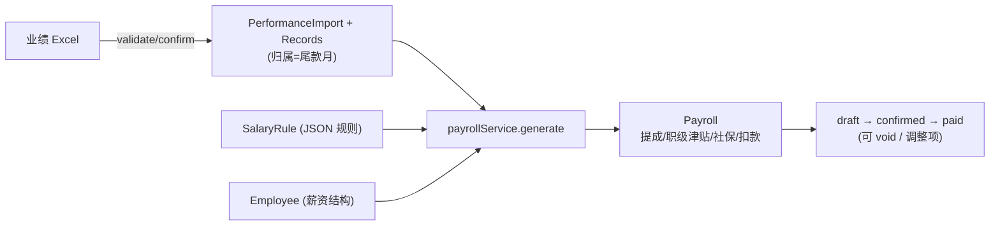

- 销售提成：按归属月业绩套**超额累进**阶梯；采购提成：`purchaseCommissionService`（采购人员卖出自营专利）；
- 业绩归属「尾款日所在月」，提成在「归属月+1」工资条发放。

### 8.5 银行对账

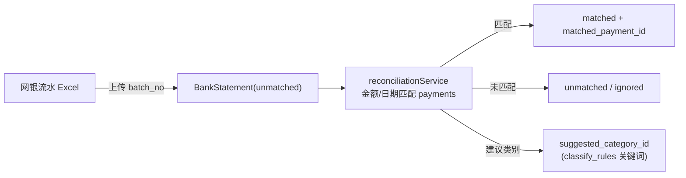

---

## 9. 定时任务（`jobs/index.js`，node-cron）

| 任务 | 频率 (cron) | 文件 | 说明 |
|------|-------------|------|------|
| 企微审批同步 | 每 10 分钟 `*/10 * * * *` | `wechatSyncJob` | 兜底拉取审批，写入合同/付款 |
| 附件同步到 COS | 每小时 30 分 `30 * * * *` | `fileSyncJob` | 本地附件转存对象存储 |
| 专利年费到期提醒 | 每日 09:00 `0 9 * * *` | `feeReminderJob` | 生成 Notification |
| 合同到期提醒 | 每日 09:00 `0 9 * * *` | `contractReminderJob` | 生成 Notification |
| 固定月费自动生成 | 每月 1 日 00:05 `5 0 1 * *` | `recurringCostJob` | 生成 is_recurring 成本 |
| 在库专利全量扫描 | 每周日 06:00 `0 6 * * 0` | `patentBatchQueryJob` | IP 系统扫描 + 异常告警 |

---

## 10. 外部集成与跨库

| 集成 | 模块 | 说明 |
|------|------|------|
| 主项目库（跨库只读） | `config/mainDatabase.js`, `models/MainUser.js` | 连 `patent_notice_system`；**不建 Sequelize 关联**，靠 `user_id` 手动 JOIN/二次查询；连接失败不阻断 ERP 启动 |
| 企业微信 | `services/wechat/*`, `config/wechat.js`, `routes/wechat.js` | 回调解密(crypto)、API 调用(api)、审批同步(sync)、文件下载(file) |
| 腾讯云 COS | `cos-nodejs-sdk-v5`, `fileSyncJob`, `wechatFileService` | 合同/审批附件存储；`/files` 代理下载 |
| IP 系统 | `services/ipSystemService.js`, `routes/patentFee.js` | 专利年费、法律状态、异常扫描数据源 |

参考文档：`docs/IP系统-代查接口需求.md`、`docs/ERP对接-年费查询接口说明.md`、`docs/T21-main-project-integration.md`。

---

## 11. 前端结构

```
frontend/src/
├── layout/MainLayout.vue        # 主框架(侧边栏+顶栏+内容区)
├── router/index.js              # 路由 + 守卫(鉴权/角色/SSO token)
├── stores/                      # user(登录态) / app(全局) / dashboard(看板缓存)
├── api/                         # 25 个接口模块 + request.js(axios 封装)
├── components/
│   ├── business/                # *Select.vue 业务下拉(客户/供应商/合同/账户/项目)
│   ├── dashboard/               # TrendChart / CostPieChart / StatCard
│   ├── layout/                  # Sidebar / SystemSwitch / NotificationBell
│   └── common/                  # Watermark / ExportButton
└── views/                       # 41 个页面(见第 6 节映射)
```

- `api/request.js`：`baseURL=/api/v1`，请求拦截注入 JWT，响应拦截统一处理 401（登出）/403/404/500；
- `stores/user.js`：token 持久化、`fetchProfile`、`logout`；
- `SystemSwitch.vue`：在主项目与 ERP 之间切换导航。

---

## 12. 数据库脚本（`backend/scripts/`）

| 脚本 | 用途 |
|------|------|
| `init-database.sql` | 建库建表 + 预置数据（如 cost_categories） |
| `add-system-settings.sql` | 系统设置表 |
| `add-sold-archive-fields.sql` | 专利售出归档字段 |
| `add-resource-type-and-anomaly.sql` | 资源类型 + 异常告警表 |
| `add-reported-high-tech.sql` | 「是否报过高企」字段 |
| `sync-tables.js` / `sync-employees.js` / `sync-history-approvals.js` | Sequelize 同步 / 数据迁移脚本 |
| `backup-to-cos.sh` | 数据库备份到 COS |
| `run-system-settings-migration.js` | 系统设置迁移 |

需求/设计文档主目录：`docs/` 与 `.kiro/specs/internal-erp-finance/`（`requirements.md` / `design.md`）。

---

## 13. 快速上手索引

| 我想… | 去看… |
|-------|-------|
| 加一个新业务模块 | 仿 `contracts`：route + controller + service + model(+index.js 关联) + validators；前端 api + view + router |
| 改某表字段 | `models/<X>.js` + 对应 `scripts/*.sql` 迁移 |
| 调权限/数据隔离 | `middlewares/auth.js`、`middlewares/permission.js` |
| 改企微同步 | `services/wechat/wechatSyncService.js`（模板映射） |
| 改利润口径 | `services/projectService.js`（毛利）、`dashboardService.js`（净利） |
| 改提成/工资规则 | `salary_rules` 表 + `salaryRuleService` + `payrollService` |
| 看定时任务 | `jobs/index.js` |
```
